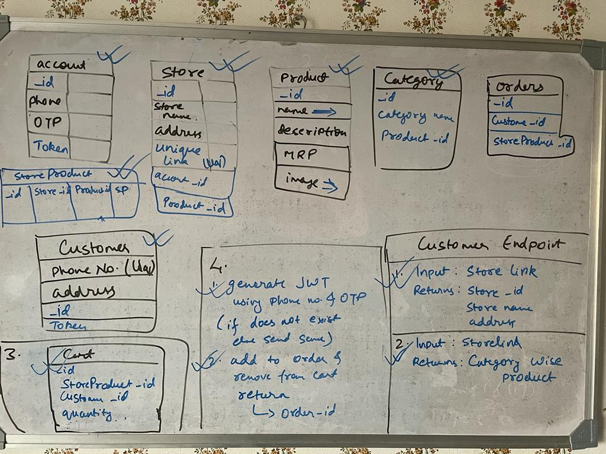

# DukaanBackend

Install Django using ```pip install Django```
and clone the repo

now navigate to the directory and run the command ```python -m commands```

now create superuser using ```python manage.py createsuperuser``` and run the project by using ```python manage.py runserver 0:8000```


check the schema of the project from the image 



and use the API collection ```dukaan.postman_collection.json``` to test the backend
